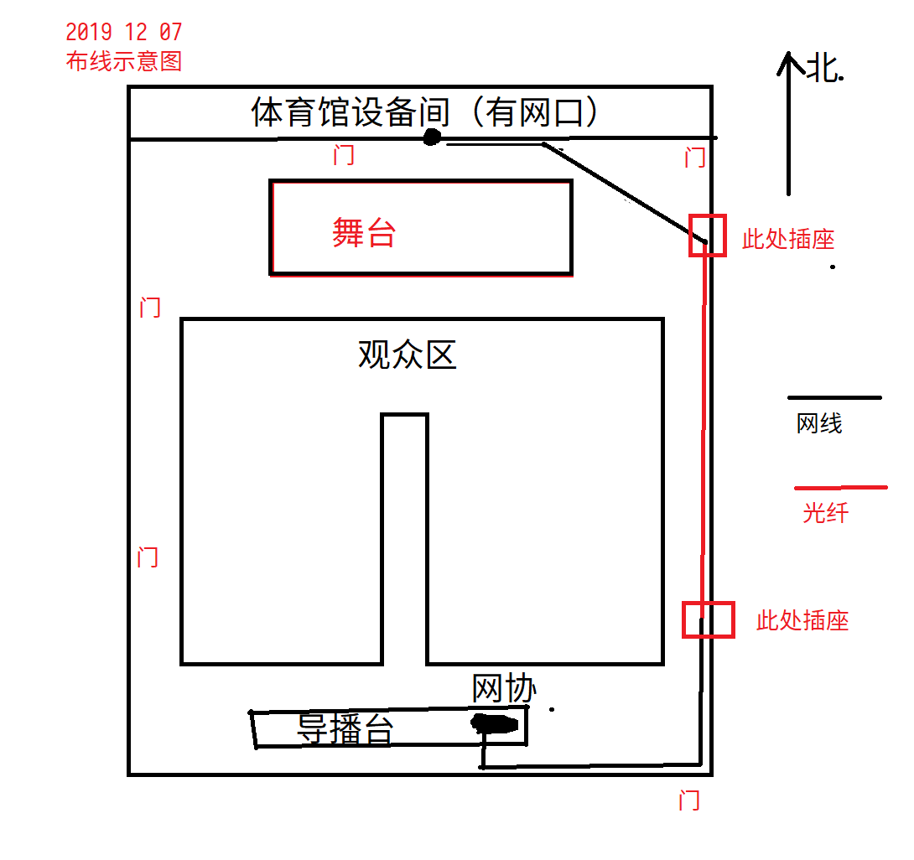

# 2019-12-7 深秋歌会直播总结

## 网络

本次直播是第一次在良乡体育馆进行的大型直播活动，因此布线方案等都需要重新规划，不过也无需在乘车赶往中关村，算是有利有弊。

由于体育馆为新建，网络铺设还不完善，万幸在直播开始前体育馆的有线网已经接通，免去了使用4G/5G网络进行直播的麻烦。

## 布线

体育馆的网口位于北侧舞台后方的设备间中，直播地点位于最南侧，距离较大，网线无法连接，因此需要使用光纤布线。由于光纤首尾都要放在有电源的位置，而又不希望光纤从门口通过，因此选择了东侧门南侧墙壁的一个插座作为起点，此时有一个问题，从设备间到插座的网线不够长，因此只能斜拉网线通过门口，这使得暴露的网线长度很大，过线桥不够长，只能使用周围的长椅凑合一下。此处应采购一些网线，目前能用的长网线只有一卷，其他都不够长。

这次光纤布置全程贴墙角，没有通过任何的门，因此简单固定即可。之后在靠南的一个插座转回网线，通过南侧的门，拉到直播地点。

## 测试

布线完成后，开始准备推流测试，此时发现一个问题，网络十分的不稳定，检查线路发现路由器频繁重启，排查后发现插排太松，经常断开加强大力固定后勉强解决（买新插座吧，这个不行了）。

新改的NPLive工作正常，B站推流也顺利通过，不过新上的Dplayer前端在iPhone上无法使用，魔改上线了旧的备用页面给iPhone。这里应该早解决更好，现场改生产环境不太好。

大约在四点多从学电处接信号测试，事实证明这有点晚了，应该更早接入测试，此次作为教训。接入后，发现黑屏，连续更换4个HDMI输出都是黑屏，尝试使用SDI接口，虽有输出，但是也占用了学电显示屏的线路，不可行。忙前忙后最终在5点左右终于找到了一个可用的输出信号，算是有惊无险的解决了问题。
